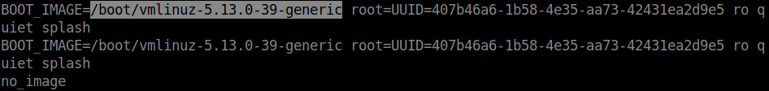
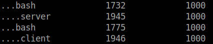
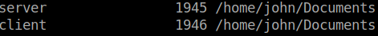
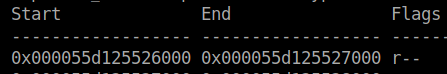

# Failed Extraction | Censored1375 
- Description: Someone deleted the echo client i was using, i need it back but i can't give you access to my pc so here's a memory image, just tell me how to extract the client, stackoverflow mentioned something about "dd" ??. Flag format n00bz{memory address to skip, count}, i.e n00bz{0xdeadbeef, 0x100}

memorydump.lime:/attachments/Failed_Extraction/memorydump.lime

# Write up

We're given a `lime` memory dump which indicates linux memory forensics, for that we need to [make a linux profile for volatility](https://n00bzunit3d.xyz/blog/loading-linux-profile-volatility2/). 

As the blog post mentioned, we need to download the correct image for our memory capture to be parsed correctly

First we need to get the linux version 

```bash
strings memdump.lime | grep -i "boot_image" 
OR 
strings memdump.lime | grep -i "linux version" 
```



`version = 5.13.0-39-generic`

Now we need to download the image and it's modules along with the correct headers, simple google search gives us [pkgs.org](https://pkgs.org/download/linux-image-5.13.0-39-generic), let's pick the first one and download it

You will also need its [module](https://pkgs.org/download/linux-modules-5.13.0-39-generic), since we picked the `amd64` image we have to download the rest of the requirements according to that 

Then we need the headers, you can get it from [archive.ubuntu.com](http://archive.ubuntu.com/ubuntu/pool/main/l/linux-hwe-5.13/) (we can find this from the [first link](https://packages.ubuntu.com/focal-updates/linux-headers-5.13.0-39-generic-lpae) on our google search)

The headers we need are `linux-headers-5.13.0-39-generic_5.13.0-39.44~20.04.1_amd64.deb` and `linux-hwe-5.13-headers-5.13.0-39_5.13.0-39.44~20.04.1_all.deb`

Remember to install the `module` and the `hwe header` first since the other 2 packages depend on them

```
# install .deb package 
sudo dpkg -i package_name.deb
```

One last step is to change the default KVER to `KVER ?= 5.13.0-39-generic` so when you do `make`, it uses the correct headers.

After you've created the profile, run `linux_pstree` to discover some interesting processes 



Run `linux_getcwd` to get the their current working directory



Run `linux_find_file -F /home/john/Documents/client` gives us nothing, meaning the file doesn't exist(same for the server), looking at the challenge description, this is probably what we're looking for

We can try dumping the file using `linux_elfs` or `linux_procdump -p 1946 -D dump/` but that's not gonna work since the file is deleted

Challenge description mentioned [dd](https://man7.org/linux/man-pages/man1/dd.1.html) as well as `memory address to skip` and `count`, we can look that up in the man page which confirms those 2 arguments does exist and can be passed to dd

Run `linux_proc_maps -p 1946` to get the client process mappings, the first line contains what we need



Here's the full command to extract the deleted binary from memory with dd (except it doesn't seem to work with a memory capture sadly)

```bash 
dd if=memorydump.lime skip=$((0x000055d125526000)) count=$((0x000055d125527000-0x000055d125526000)) of=./client
```

Meaning 
```
skip = 0x000055d125526000
count = 0x$((0x000055d125527000-0x000055d125526000)) -> 0x4096
```

The original idea was for you to extract the deleted client file from memory and reverse engineer it to find the flag but i couldn't get that working so i had to salvage the idea :(, here's where i got the idea [video](https://www.youtube.com/watch?v=uYWTfWV3dQI&t=225s) if you figure out how to extract the deleted file please do DM me :p   

# Flag - n00bz{0x000055d125526000, 0x4096}