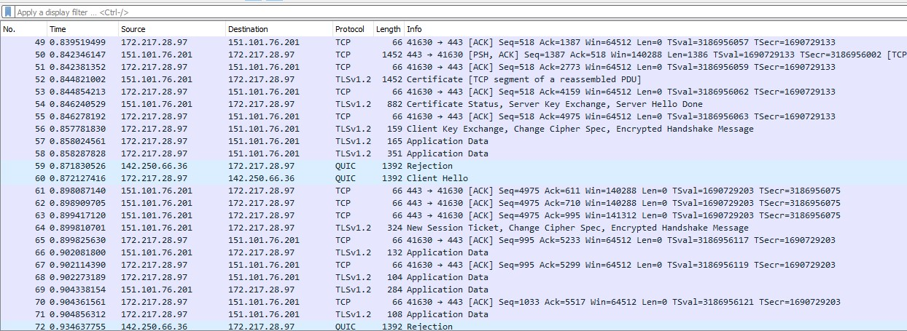
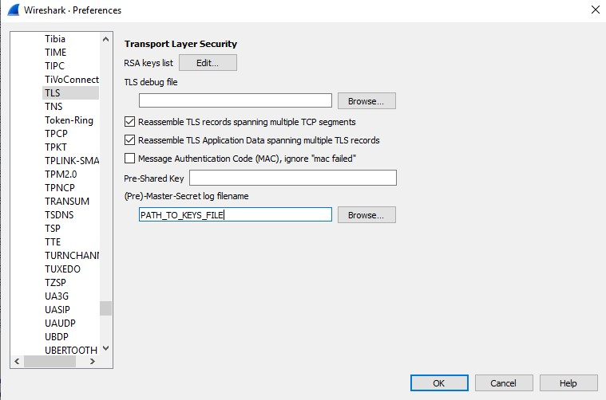
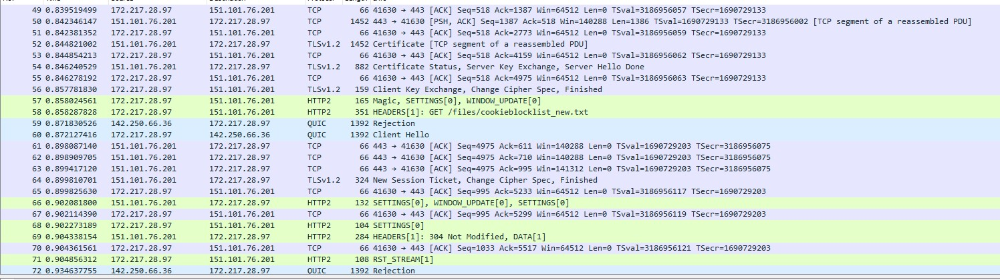
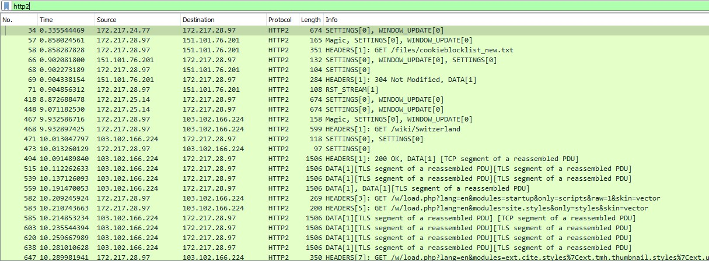
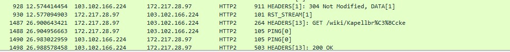

# Packets don't lie | Censored1375

- Description: Our agents managed to capture some https traffic of our target, can you decrypt it and find out where he's planning to go? Flag format n00bz{city_name_in_lowercase}

https_keys.log:/attachments/Packets_dont_lie/https_keys.log 
https.pcapng:/attachments/Packets_dont_lie/https.pcapng 

# Write up 

From the challenge, we are given a packet capture file and a keys file, open that up in [Wireshark](https://www.wireshark.org/), we can see that most of the traffic is more or less encrypted due to the websites using [https](https://www.cloudflare.com/learning/ssl/what-is-https/)

Normally we can't decrypt this to see what's actually happening but since we've captured the ssl keys along with the traffic using those keys, we can use that to decrypt the traffic 

First we load the keys into wireshark by going into `Edit > Preferences > Protocols > TLS` and change the path of `(Pre)-Master-Secret log filename` to the keys file location

After importing the keys you should see something similar to this 

As you can see the traffic is now decrypted, from the challenge description, it seems our target was using his browser at the time of packet capture so `decrypted https(http2)` is what we are on the lookout for 

To see all http2 traffic simply apply it as a filter 

Looking at the traffic, we can see he's having a look at `Switzerland` because of the `GET /wiki/Switzerland` header 

Scroll down a bit more and we see something similar but this time its `GET /wiki/Kapell%C3%BCcke` instead

  

Googling `Kapell%C3%BCcke`, we can see that it's someform of bridge located in `Lucerne city`, central Switzerland

Wrap `n00bz{}` around the city name(convert to lowercase) and you have the flag 

# Flag - n00bz{lucerne}
