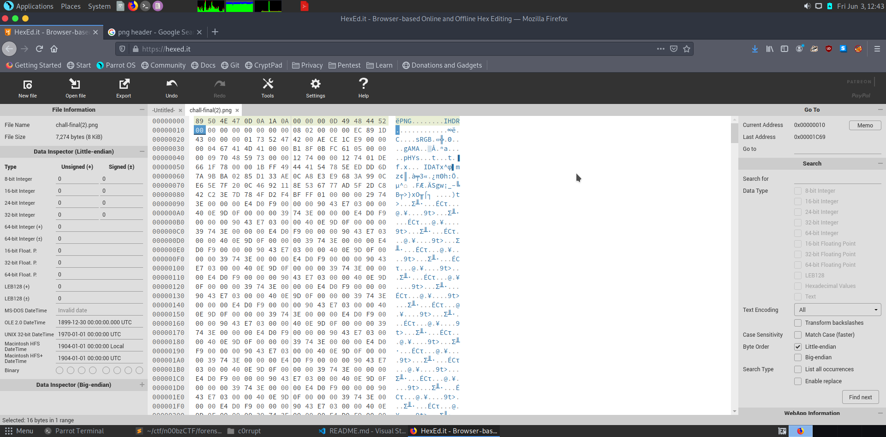
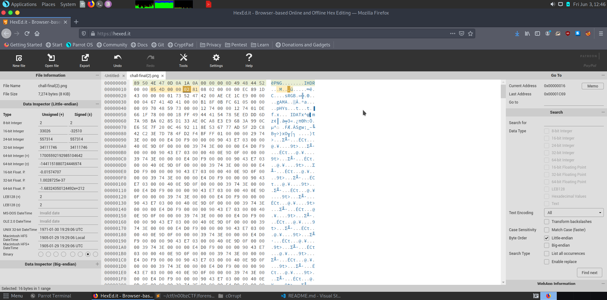
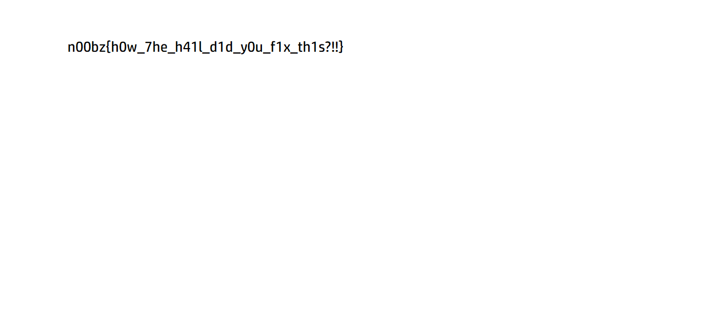

# C0rrupt | NoobMaster

-Description: Some h3ck3rs have been sending secret data using corrupted png's, Find the data!
chall:/attachments/C0rrupt/c0rrupted.png
# Write up

The png file has a wrong header, so first of all we fix that



next we see someone tampered with the width and height, so we need to fix this, the script for the same is :

```py
#!/usr/bin/env python3

from pwn import p32
from zlib import crc32
required_crc = 0xEC891D43
max_dimension = 4000
for height in range(600,1000):
    for width in range(1300,2000):
        ihdr = b'\x49\x48\x44\x52' + p32(width, endian='big') + p32(height, endian='big') + b'\x08\x02\x00\x00\x00'
        crc = crc32(ihdr)
        print(hex(crc))
        print(width,height)
        if crc == required_crc:
            print('Found width and height!')
            print(width,height)
            exit(0)
```

Result -

```
Found width and height!
1357 641
```

Now we use hexedit to edit the width and height of the image, we turn them into hex and and them like this -



now when we open the image we are greeted with the flag!,



# Flag - n00bz{h0w_7h3_h41l_d1d_y0u_f1x_th1s?!!}
